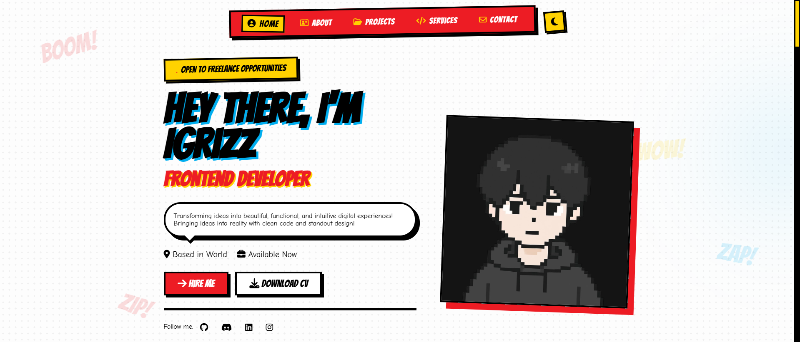

# 💥 OM CODES - Comic Style Portfolio 💥



<p align="center">
  <a href="https://github.com/omrajputt369-byte" target="_blank">
    
  </a>
  <a href="https://comicsportfolio.netlify.app/" target="_blank">
    
  </a>
</p>

Welcome to the **OM CODES** repository! This is a personal portfolio website designed with a unique **Comic Book / Pop Art** aesthetic ("Spider-Verse" inspired). It showcases my skills, projects, and services as a Frontend Developer and UI/UX Designer.

## 🔗 Live Demo

You can view the live project here: [https://comicsportfolio.netlify.app/](https://comicsportfolio.netlify.app/)

## 🌟 Features

*   **Comic Book Design**: Vibrant colors (Yellow, Red, Cyan), bold typography (Bangers), and halftone patterns.
*   **Responsive Layout**: Fully optimized for Desktop, Tablet, and Mobile devices.
*   **Custom Animations**:
    *   Preloader with a retro comic loading bar.
    *   Scroll reveal animations (slide-in effects).
    *   Hover effects on buttons and cards.
*   **Dark Mode**: A sleek dark theme toggle for better night-time viewing.
*   **Interactive Elements**: Floating comic words ("BOOM!", "ZAP!"), "Top Secret" stamps, and tape effects.

## 🛠️ Technologies Used

*   **HTML5**: Semantic structure.
*   **CSS3**: Custom properties (variables), Flexbox, Grid, and Animations.
*   **JavaScript (ES6+)**: DOM manipulation, Scroll Observer, and Theme logic.
*   **Font Awesome**: Icons for social media and UI elements.
*   **Google Fonts**: 'Bangers' for headers and 'Comic Neue' for body text.

## 📂 Project Structure

```bash
Portfolio Design/
├── images/             # Project screenshots and assets
├── index.html          # Main HTML structure
├── style.css           # All styles and responsive design
├── script.js           # Logic for interactions and animations
└── README.md           # Project documentation
```

## 🚀 How to Run

1.  Clone this repository or download the ZIP file.
2.  Open the folder in your code editor (e.g., VS Code).
3.  Open `index.html` in your browser (or use Live Server).

## 🎨 Color Palette

*   **Yellow**: `#FFD200`
*   **Red**: `#ED1C24`
*   **Cyan**: `#00AEEF`
*   **Black**: `#000000`
*   **Paper White**: `#FDFDFD`

## 📧 Contact

*   **Email**: omrajputt369@gmail.com
*   **GitHub**: [OM02](https://github.com/omrajputt369-byte)
*   **LinkedIn**: [OM](https://www.linkedin.com/in/om-rajput369)

---
© 2026 OM CODES. All Rights Reserved &
Developed by **OM**

